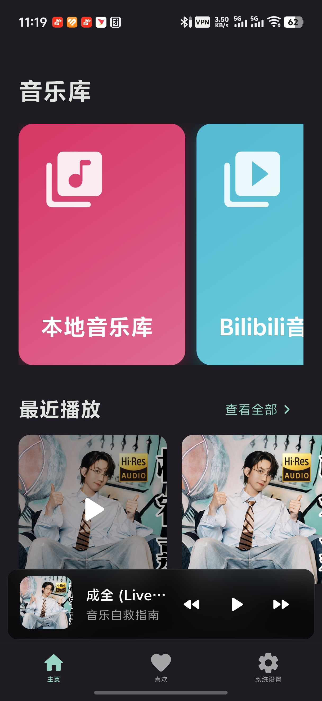
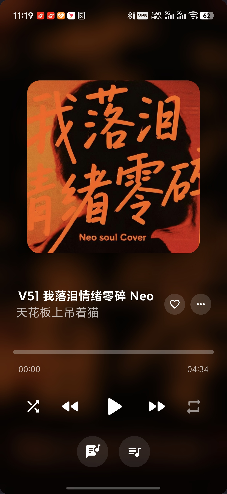

<p align="center">
  
  <h1 align="center">Motto Music</h1>
</p>

<p align="center">
  <a href="https://github.com/motto1/motto-music/releases/latest">
    
  </a>
  <a href="https://github.com/motto1/motto-music/releases/latest">
    
  </a>
  <a href="https://github.com/motto1/motto-music/blob/main/LICENSE">
    
  </a>
  <a href="https://github.com/motto1/motto-music/stargazers">
    
  </a>
</p>

<p align="center">
  <strong>基于 Flutter 开发的 Android 音乐播放器</strong>
  <br>
  专为"本地收藏 + Bilibili 音源"使用场景设计
</p>

<p align="center">
  <a href="https://github.com/motto1/motto-music/releases/latest">📥 下载最新版本</a>
  ·
  <a href="https://github.com/motto1/motto-music/issues">🐛 反馈问题</a>
  ·
  <a href="https://github.com/motto1/motto-music/discussions">💬 讨论交流</a>
</p>

---

> **注意**：本项目目前仅适配 Android 平台，暂无其他平台支持计划。


---

## ✨ 特色能力

| 能力 | 说明 |
| --- | --- |
| 🎧 音频 | 支持本地音乐文件和 Bilibili 音源，统一管理与播放 |
| 🧠 歌词 | 自动解析 LRC/TTML 格式，内置歌词搜索(网易云API)、偏移调整与手动导入 |
| 🖼️ 播放器 | 模仿AM风格界面、动态封面、流畅动画与直观控制 |
| 🔒 锁屏控制 | 简介锁屏界面，支持歌词滚动和全功能播放控制 |
| 📂 存储 | 自定义 Bilibili 下载目录 |
| 🔁 智能下载 | 可调并发、自动缓存、音频质量选择、LRU 缓存管理、断点续传 |
| 🧩 模块化架构 | Service 层设计，便于扩展和维护 |

---

## 🏗️ 技术栈

- **Flutter 3.3+ / Dart 3**：UI 渲染、状态管理与路由
- **Drift + sqlite3_flutter_libs**：本地数据库（歌曲、下载、设置等）
- **audio_service + just_audio**：音频播放与通知栏/锁屏控制
- **Dio / connectivity_plus / permission_handler**：网络请求、连接检测与权限管理
- **cached_network_image / flutter_cache_manager**：图片和音频缓存
- **自建 Service 模块**：`bilibili`、`lyrics`、`cache`、`player` 等模块化服务

---

## 📁 项目结构速览

```
lib/
├─ services/            # 业务服务（Bilibili、歌词、缓存、下载、播放器等）
├─ views/               # 页面（Settings、Library、Bilibili 相关等）
├─ widgets/             # 复用组件（歌词工具、播放器控件、对话框等）
├─ models/              # 数据模型（Drift 数据类、Lyrics、Download 事件等）
├─ database/            # Drift 定义及适配层
├─ platform/            # 桌面 & 移动平台增强能力
└─ utils/               # 通用工具（主题、解析、路径处理等）
```

---

## 🚀 快速开始

### 1. 环境要求

- Flutter >= 3.3（推荐使用最新 stable channel）
- Dart >= 3.3
- Android SDK（API 21+）
- Git（用于拉取/提交代码）

### 2. 克隆仓库

```bash
git clone https://github.com/motto1/motto-music.git
cd motto-music
flutter pub get
```

### 3. 运行 / 构建

```bash
# 连接 Android 设备或启动模拟器后运行
flutter run

# 构建 APK 安装包
flutter build apk --split-per-abi

# 构建 App Bundle（推荐用于发布）
flutter build appbundle
```

> **提示**：首次运行会在设备的 Music 目录创建 `MottoMusic` 文件夹，用于存储 Bilibili 下载内容。

---

## 📸 应用截图

> 截图展示即将上传

<!-- 
<p align="center">



</p>
-->

---

## 🛣️ Roadmap

- [ ] **UI风格统一**：统一多个页面的风格一致性，修复BUG
- [ ] **歌词体验优化**：歌词翻译多行显示、更多歌词源、可视化偏移调节
- [ ] **模块化配置**：支持备份配置、导入导出
- [ ] **Bilibili接入**：点赞、三连、收藏夹控制
- [ ] **性能优化**：启动速度优化、内存占用优化、流畅度提升
- [ ] **播放增强**：均衡器、音效、淡入淡出、定时停止

欢迎通过 Issue/Discussions 提交新的功能建议。

---

## 🤝 贡献指南

1. Fork 仓库并创建分支：`git checkout -b feat/my-feature`
2. 提交前运行 `flutter format` 与必要的 `flutter test`
3. 提交信息遵循 Conventional Commits，示例：`feat(bilibili): support custom download directory`
4. 提交 PR 前请确认：
   - 新增/更新文档
   - 包含必要的截图 / 日志 / 复现步骤
   - 未引入敏感信息、未提交编译产物

欢迎任何形式的贡献，包括 Bug 反馈、新特性提案和 UI 设计建议。


---

## 📄 开源许可

本项目基于 **Apache License 2.0** 开源。详见 [LICENSE](LICENSE)。

---

## 🙏 致谢

- [Flutter](https://flutter.dev/) / [Dart](https://dart.dev/) 官方团队与社区
- [namida](https://github.com/namidaco/namida)、[BBPlayer](https://github.com/bbplayer-app/BBPlayer)、[LZF-Music](https://github.com/GerryDush/LZF-Music) 等优秀开源项目。此项目大量借鉴了前辈的代码和路径
- 本项目完全由vibecoding开发，代码细节可能经不起推敲
- 感谢linuxdo社区的优秀服务商和公益站
---

## 💖 支持项目

如果你喜欢这个项目，欢迎：

- ⭐ 给项目一个 Star
- 🐛 [反馈 Bug](https://github.com/motto1/motto-music/issues)  
- 💡 [提出建议](https://github.com/motto1/motto-music/discussions)
- 🔀 [提交 PR](https://github.com/motto1/motto-music/pulls)

---

<p align="center">
  由个人兴趣开发，为社区贡献自己的力量
  <br>
  <sub>基于 Flutter 构建 | 专注 Android 平台</sub>
</p>
